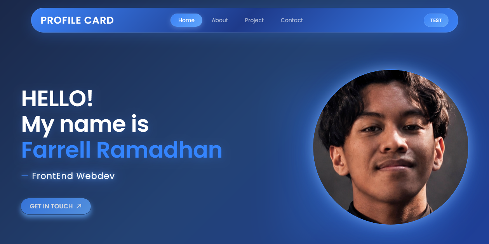
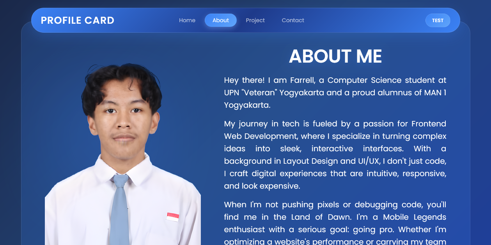
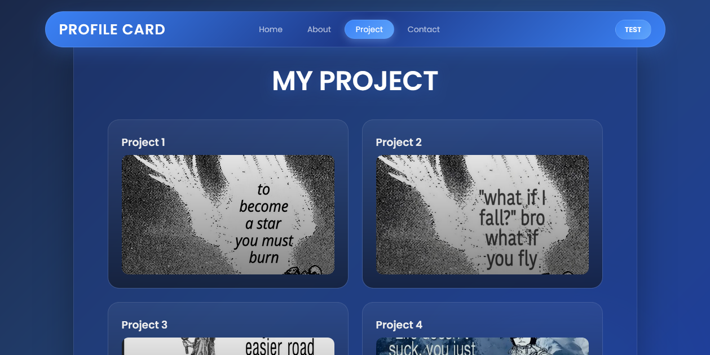
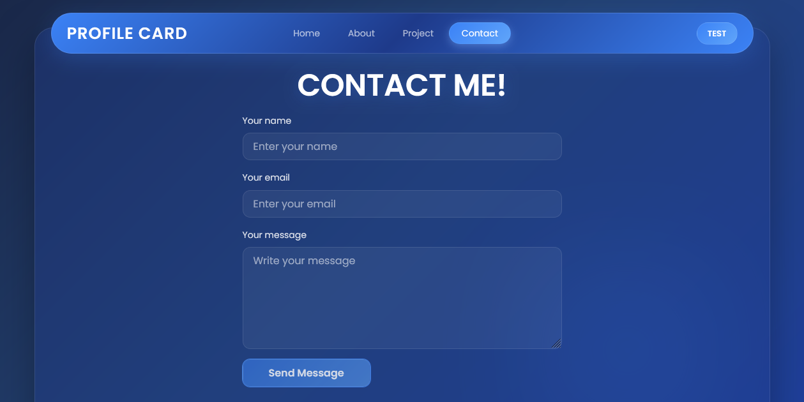
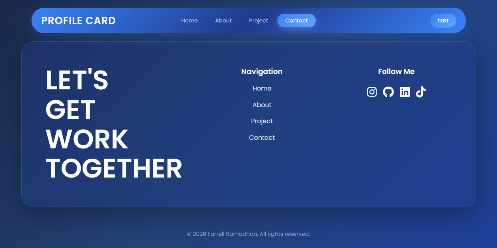

💼 Personal Portfolio Website

A modern and responsive personal portfolio website built to showcase my profile, skills, projects, and professional journey as a Front-End Web Developer.

👋 About

Hi! I’m Farrell Ramadhan, a Computer Science student at UPN “Veteran” Yogyakarta with a strong passion for Frontend Web Development, UI/UX Design, and creating engaging digital experiences.

This portfolio serves as a central place where I share my projects, technical skills, and contact information for potential collaborations and opportunities.

✨ Features

* Responsive design for desktop and mobile devices
* Smooth scrolling navigation
* Interactive hero section
* About Me section
* Project showcase gallery
* Contact form
* Social media integration
* Modern UI with custom animations

🛠️ Tech Stack

Frontend

* HTML5
* CSS3
* JavaScript (Vanilla JS)

Design

* Figma
* UI/UX Design Principles
* Responsive Web Design

📂 Sections

- Home -

Introduction and personal branding.

- About Me -

Brief background, education, interests, and career goals.

- Projects -

A collection of selected projects showcasing my development skills and creativity.

- Contact -

Contact form and social media links for networking and collaboration.

🚀 Live Demo

Visit the website here:

https://mfarrellramadhan-arch.github.io/PROFILE-CARD/

📸 Preview

You can add a screenshot of your website here:

 

🎯 Future Improvements

* Dark/Light mode toggle
* Project filtering system
* Blog section
* Multi-language support
* Performance optimization
* Accessibility enhancements

🤝 Let’s Connect

* Instagram: @flerstilljobless
* GitHub: mfarrellramadhan-arch
* LinkedIn: Farrell Ramadhan

📄 License

This project is created for personal portfolio purposes.

© 2026 Farrell Ramadhan. All rights reserved.
